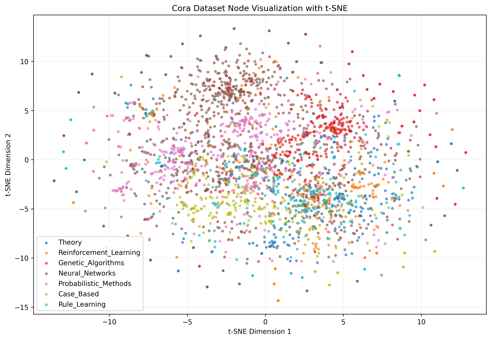

# Cora 数据集可视化工具

一个用于可视化Cora引文网络数据集的Python工具，提供子图可视化和t-SNE降维可视化功能。

## 项目概述

Cora数据集（Citation Network Dataset）是一个经典的学术引文网络数据集，广泛应用于图神经网络、节点分类和图表示学习的研究中。

### Cora数据集详细介绍

#### 基本统计信息
- **论文数量**: 2,708篇机器学习领域的学术论文
- **引用关系**: 5,429条论文之间的引用链接（有向边）
  - 每条边代表一篇论文引用另一篇论文的关系
  - 方向性：从引用论文指向被引用论文
  - 平均每个节点有约2.0条出边（引用其他论文）
  - 平均每个节点有约2.0条入边（被其他论文引用）
  - 引用网络呈现出明显的社区结构，同类论文之间引用更频繁
- **特征维度**: 每篇论文用1,433维的词袋特征向量表示
  - **特征类型**: 二进制词袋特征（0/1表示）
  - **词汇来源**: 从所有论文的标题和摘要中提取的关键词
  - **特征含义**: 每个维度对应一个特定单词是否出现在论文中
  - **预处理**: 经过停用词过滤和词干提取处理
  - **稀疏性**: 特征向量非常稀疏，大多数维度为0
  - **信息含量**: 保留了论文的主要主题和内容信息
- **类别数量**: 7个不同的机器学习研究领域
  - **Case_Based** (基于案例的方法)
    - 使用相似案例进行推理和预测的方法
    - 包括最近邻算法、案例推理系统等
  
  - **Genetic_Algorithms** (遗传算法)
    - 模拟自然进化过程的优化算法
    - 包括选择、交叉、变异等操作
  
  - **Neural_Networks** (神经网络)
    - 人工神经网络及其应用
    - 包括多层感知机、卷积神经网络、循环神经网络等
  
  - **Probabilistic_Methods** (概率方法)
    - 基于概率论的机器学习方法
    - 包括贝叶斯网络、隐马尔可夫模型、概率图模型等
  
  - **Reinforcement_Learning** (强化学习)
    - 通过试错学习最优策略的方法
    - 包括Q-learning、策略梯度、深度强化学习等
  
  - **Rule_Learning** (规则学习)
    - 从数据中学习决策规则的方法
    - 包括决策树、关联规则挖掘、归纳逻辑编程等
  
  - **Theory** (机器学习理论)
    - 机器学习的理论基础和数学分析
    - 包括学习理论、计算复杂性、统计学习理论等

#### 数据集结构
1. **节点（Nodes）**: 每篇论文作为一个节点
2. **边（Edges）**: 论文之间的引用关系，构成有向图
3. **节点特征**: 基于论文摘要的词袋模型特征
4. **节点标签**: 论文所属的研究领域类别

#### 特征表示
- 特征向量维度：1,433
- 表示方法：词袋模型（Bag-of-Words）
- 词汇表：从所有论文摘要中提取的关键词
- 特征值：二进制表示（0/1），表示关键词是否出现在论文中

#### 图结构特性
- **图类型**: 有向图（引用关系具有方向性）
- **连通性**: 包含一个大的连通分量和若干小分量
- **节点度分布**: 符合幂律分布，少数论文被大量引用
- **聚类系数**: 相对较高，显示学术社区的聚集性

#### 学术意义
Cora数据集是图机器学习领域的基准数据集之一，常用于：
- 节点分类任务
- 图神经网络性能评估
- 引文网络分析
- 学术影响力研究

#### 数据来源
原始数据来源于：
- 机器学习相关会议和期刊论文
- 论文摘要和引用信息
- 经过人工标注和整理

## 功能特性

### 1. 子图可视化
- 随机选择指定数量的节点生成子图
- 默认使用Spring布局算法展示网络结构，并支持有向边显示引用关系
- 节点颜色根据论文类别进行区分，并包含图例
- 显示子图的节点数和边数统计信息
- 支持高质量图片保存（300 DPI）

### 2. t-SNE降维可视化
- 使用t-SNE算法将1433维特征降维到2维
- 可视化所有节点在二维空间中的分布
- 不同类别使用不同颜色标记
- 包含完整的图例说明

### 3. 自动保存功能
- 所有可视化结果自动保存到`output/`文件夹
- 支持PNG格式高质量输出
- 控制台显示保存路径确认信息

## 安装依赖

```bash
pip install torch torch-geometric networkx matplotlib scikit-learn numpy
```

## 项目结构

```
Cora-Visualizer/
├── data/               # 数据集目录（自动下载）
│   └── Planetoid/
│       └── Cora/
├── output/             # 输出图片目录
│   ├── cora_subgraph.png
│   └── cora_tsne.png
├── vis_cora.py         # 主程序文件
└── README.md          # 项目说明文档
```

## 使用方法

### 基本运行
```bash
python vis_cora.py
```

### 自定义可视化
在`vis_cora.py`的主函数中，您可以：

1. **子图可视化**：
   默认情况下，子图可视化是启用的。您可以调整节点数量和保存路径：
```python
visualize_subgraph(data, num_nodes=200, save_path='output/cora_subgraph_large.png')
```
   您也可以尝试不同的布局算法，例如将 `nx.spring_layout(G_sub)` 替换为 `nx.random_layout(G_sub)` 或 `nx.spectral_layout(G_sub)` 等。

2. **修改t-SNE参数**：
在`visualize_tsne`函数中调整t-SNE参数：
```python
tsne = TSNE(n_components=2, random_state=42, perplexity=30, n_iter=1000)
```

## 输出示例

### t-SNE可视化输出
- 文件：`output/cora_tsne.png`
- 内容：所有2708个节点在二维空间的分布
- 颜色：7个不同类别使用不同颜色
- 图例：包含所有论文类别的完整名称



#### t-SNE可视化结果分析

**目的与方法**

本节展示了Cora数据集的t-SNE（t-distributed Stochastic Neighbor Embedding）降维可视化结果。t-SNE是一种非线性降维技术，旨在将高维数据（本例中为每篇论文的1,433维词袋特征向量）映射到低维空间（2维），以便于直观地观察数据的内在结构和聚类特性。与线性降维方法（如PCA）不同，t-SNE更侧重于保留高维空间中的局部邻域结构，使得相似的数据点在低维嵌入中依然保持接近。

**结果解读**

如图所示，t-SNE可视化结果清晰地揭示了Cora数据集中论文的类别结构。图中每个点代表一篇论文，其颜色对应于论文所属的7个机器学习研究领域之一。观察结果可以得出以下几点：

1.  **显著的类别分离**：不同颜色的点在二维空间中形成了多个相对独立且边界清晰的簇。这表明，即使在高维特征空间中，不同研究领域的论文在内容上（由词袋特征表示）也存在显著差异，t-SNE成功地将这些语义上的差异映射到了几何距离上。

2.  **内部紧凑性**：每个颜色簇内部的点分布相对紧密，这说明同一研究领域的论文在特征空间中具有高度的相似性。例如，属于“Neural_Networks”类别的论文倾向于聚集在一起，形成一个密集的区域。

3.  **局部重叠与交叉**：尽管整体分离良好，但在某些簇的边缘区域，可以看到不同颜色的点存在一定程度的重叠或交叉。这可能反映了以下情况：
    *   **领域交叉性**：某些论文可能涉及多个研究领域，其内容特征介于不同类别之间。
    *   **特征局限性**：1,433维的词袋特征虽然丰富，但可能未能完全捕捉到所有论文的细微语义差异，导致少数论文在特征空间中与非本类别的论文更为接近。
    *   **t-SNE的局部优化特性**：t-SNE在优化局部结构时，有时可能牺牲全局结构，导致一些全局上的距离关系未能完美保留。

**结论**

t-SNE可视化结果有力地证明了Cora数据集在特征层面具有良好的类别可分性。不同研究领域的论文形成了可区分的语义簇，这为后续的节点分类任务提供了坚实的基础。同时，局部重叠的现象也提示了数据集内在的复杂性和领域间的潜在关联。

### 子图可视化输出  
- 文件：`output/cora_subgraph.png`
- 内容：随机选择的100个节点及其连接关系
- 布局：Spring力导向布局
- 节点：大小统一，颜色按类别区分

## 技术栈

- **PyTorch Geometric**: 图神经网络数据处理
- **NetworkX**: 图结构分析和可视化
- **Matplotlib**: 科学绘图和可视化
- **Scikit-learn**: t-SNE降维算法
- **NumPy**: 数值计算

## 代码说明

### 主要函数

#### `visualize_subgraph(data, num_nodes=50, save_path=None)`
- 功能：生成并显示Cora数据集的子图可视化
- 参数：
  - `data`: Cora数据集对象
  - `num_nodes`: 子图节点数量（默认50）
  - `save_path`: 图片保存路径（可选）

#### `visualize_tsne(data, save_path=None)`
- 功能：使用t-SNE降维并可视化所有节点
- 参数：
  - `data`: Cora数据集对象
  - `save_path`: 图片保存路径（可选）

### 文件保存
所有图片以300 DPI的高质量保存，使用`bbox_inches='tight'`确保完整显示。

## 扩展功能

您可以轻松扩展此项目：

1. **添加新的可视化方法**：
   - PCA降维可视化
   - UMAP降维可视化
   - 3D可视化

2. **支持其他数据集**：
   - CiteSeer
   - PubMed
   - 自定义图数据集

3. **交互式可视化**：
   - 使用Plotly创建交互式图表
   - Web界面集成

## 常见问题

### Q: 数据集下载失败？
A: 确保网络连接正常，或者手动下载数据集到`data/Planetoid/Cora/`目录

### Q: 内存不足？
A: 减少`num_nodes`参数值，或使用更小的子图

### Q: 图片保存失败？
A: 确保有写入权限，output目录会自动创建

## 许可证

本项目使用MIT许可证。

## 贡献

欢迎提交Issue和Pull Request来改进这个项目！

## 更新日志

### v1.1.0 (2024)
- 改进子图可视化：添加节点类别图例、节点/边统计信息
- 改进子图可视化：支持有向边显示引用关系
- 修复了重复导入 `matplotlib.patches` 的问题
- 优化 `README.md` 文档，使其更清晰和全面

### v1.0.0 (2024)
- 初始版本发布
- 支持子图可视化
- 支持t-SNE降维可视化
- 自动图片保存功能